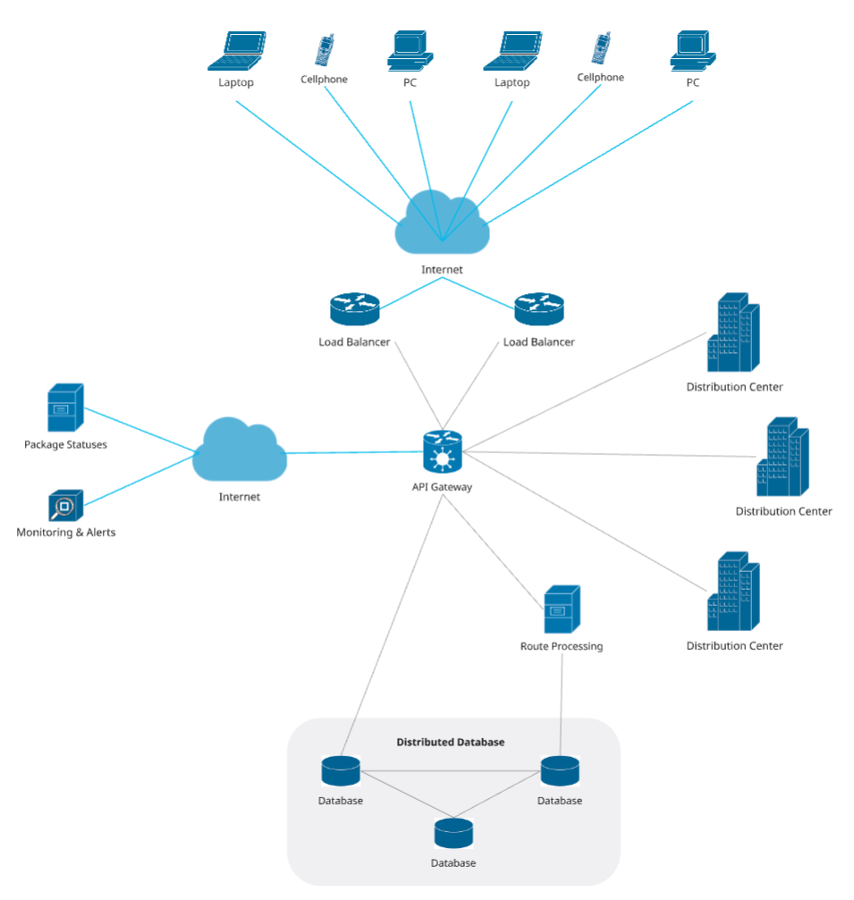

# 🗒️ Registro de Trabajo en Clase - Taller 4

## 📆 Fecha de la sesión
_06/09/2025_

## 👥 Integrantes presentes
- Juan David Cetina Gómez
- Ana Lucía Quintero Vargas
- Mariana Salas Gutiérrez

## 🧠 Actividades realizadas en clase

Durante la sesión, el grupo se enfocó principalmente en leer y comprender el caso asignado, así como en definir la manera de trabajo. Se organizaron responsabilidades y se acordó cómo continuar el desarrollo de los mapa de infraestructura fuera de clase. Por tanto, el ejercicio se orientó más a establecer lineamientos iniciales y referencias que a construir el diagrama completo en ese mismo momento.

- *¿Qué se discutió con el equipo?*

  El equipo conversó sobre cómo abordar la representación del caso de RedExpress, revisando qué componentes eran necesarios incluir (balanceadores, API Gateway, servicios en la nube, servidores regionales y centros de distribución). Más que discutir aspectos técnicos en detalle, se buscó un criterio común sobre la interpretación del caso (elementos principales y sus relaciones) y la forma en que se organizaría el trabajo colaborativo.

- *¿Qué decisiones de modelado se tomaron?*

  Se decidió trabajar de forma colaborativa en Miro, aprovechando una de sus plantillas disponibles para diagramas de infraestructura. Dado que algunas figuras o iconos eran de la versión premium, se complementó el trabajo incorporando íconos de Cisco descargados de internet, con el fin de representar de manera más clara los distintos componentes. Además, se acordó que cada elemento llevara un nombre descriptivo para facilitar su interpretación posterior.
  
- *¿Qué herramientas se usaron (papel, pizarra, draw.io, Astah)?*
  
  La herramienta principal fue Miro, combinada con recursos externos como los iconos de Cisco. También se consultó material de referencia en línea, incluyendo ejemplos de diagramas para apoyar la toma de decisiones sobre la representación.
  
- *¿Qué parte del trabajo se alcanzó a desarrollar?*
  
  En esta sesión no se avanzó mucho en el diagrama final, pero sí se logró crear el repositorio y el espacio de trabajo en Miro, además de establecer la división de responsabilidades entre los integrantes. Igualmente, se dedicó parte del tiempo a explorar ejemplos en internet y evaluar cómo podrían adaptarse a los requerimientos del caso. La construcción detallada del diagrama se dejó como tarea posterior.

## 🧩 Boceto inicial del modelo

El diagrama muestra la infraestructura híbrida de RedExpress, donde los usuarios acceden desde dispositivos móviles o computadores a través de internet. Las solicitudes pasan primero por los balanceadores de carga, que distribuyen el tráfico hacia el API Gateway, el cual centraliza la comunicación con los distintos servicios.

Desde allí se conectan los centros de distribución (infraestructura regional), el módulo de procesamiento de rutas, la base de datos distribuida y los servicios en la nube de monitoreo y alertas junto con estado de paquetes. De esta forma, se integran tanto recursos locales como servicios en la nube para garantizar disponibilidad y soporte a la operación logística.

A partir de este modelo preliminar, se identificarón diferentes aspectos clave que requieren un diagnóstico posterior...

## 🔁 Tareas definidas para complementar el taller

Anote las responsabilidades acordadas entre los miembros del equipo para completar la entrega final:

| Tarea asignada | Responsable | Fecha estimada |
|----------------|-------------|----------------|
| Modelado final en Miro | Mariana Salas Gutiérrez y Ana Lucía Quintero Vargas | 09/09 |
| Redacción del informe     | Mariana Salas Gutiérrez y Juan David Cetina Gómez | 11/09 |
| Investigación y referencias | Juan David Cetina Gómez | 11/09 |

---

_Este documento resume el trabajo colaborativo realizado durante la sesión del taller 4 en el curso AREM - Universidad de La Sabana._
