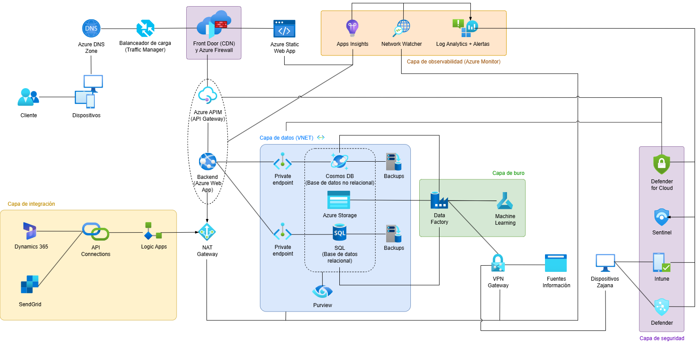

# 📄 Informe Técnico del Taller

## 🔖 Nombre del Taller
_Taller 4 - Mapa de Infraestructura y Diagnóstico Técnico_

## 👥 Integrantes del equipo
- Juan David Cetina Gómez (juancego@unisabana.edu.co)
- Ana Lucía Quintero Vargas (anaquiva@unisabana.edu.co)
- Mariana Salas Gutiérrez (marianasalgu@unisabana.edu.co)

# 📄 Informe Técnico del Taller

## 🧠 Descripción general del trabajo  
El taller tuvo como propósito aprender y aplicar los conceptos de infraestructura lógica, tomando como referencia el caso base de RedExpress y, posteriormente, adaptando lo aprendido a la empresa seleccionada, Zajana S.A.S. En el grupo se discutió principalmente cómo debían representarse las capas y los servicios de la arquitectura, identificando las conexiones necesarias entre actores, dispositivos y componentes internos y externos.  

## 🔧 Proceso de desarrollo  
El desarrollo del trabajo se realizó mediante la herramienta draw.io, que permitió la diagramación colaborativa de la infraestructura. La primera decisión fue organizar los servicios en capas lógicas para mejorar la claridad: integración, datos, buro, seguridad y observabilidad. Posteriormente, se añadieron las conexiones entre cada componente, asegurando que quedara explícito cómo interactúan el cliente y los dispositivos internos con el ecosistema de servicios en la nube. Finalmente, se incluyeron servicios transversales de seguridad, gobernanza y monitoreo, de acuerdo con las mejores prácticas de Azure, con el fin de dar un panorama completo de la infraestructura lógica actual de Zajana.  

## 🧩 Análisis del modelo propuesto  

- **¿Cómo se estructura el modelo entregado?**  
  El modelo está dividido en cinco capas:  
  - **Capa de integración:** Incluye Dynamics 365, SendGrid, API Connections y Logic Apps para gestionar la conexión con sistemas externos.  
  - **Capa de datos (VNET):** Contiene Cosmos DB, SQL Database, Azure Storage, Backups y Purview, protegidos por private endpoints.  
  - **Capa de buro:** Data Factory y Machine Learning, responsables de los procesos analíticos y predictivos.  
  - **Capa de observabilidad:** Azure Monitor, compuesto por Apps Insights, Network Watcher y Log Analytics + Alertas, para el monitoreo centralizado.  
  - **Capa de seguridad:** Defender for Cloud, Sentinel, Defender e Intune, que garantizan la protección de los activos de Zajana.  

  Adicionalmente, Front Door con CDN y Firewall, junto con Azure APIM (API Gateway), permiten gestionar el tráfico entrante y exponer los servicios de forma segura, mientras que el NAT Gateway regula el tráfico saliente hacia internet.  

- **¿Cómo representa las necesidades del cliente?**  
  El modelo refleja la necesidad de alta disponibilidad, seguridad y escalabilidad para los clientes que consultan y consumen los servicios de Zajana. La integración de herramientas como Dynamics 365 y SendGrid muestra la orientación hacia procesos comerciales y de comunicación efectivos. Las bases de datos en la capa de datos, junto con Purview, aseguran la trazabilidad y gobernanza de la información. El monitoreo con Azure Monitor y la seguridad con Sentinel y Defender garantizan continuidad, protección frente a incidentes y trazabilidad de operaciones, respondiendo a los requisitos críticos de clientes en sectores sensibles como el financiero.  

- **¿Qué supuestos se tomaron?**  
  - Se asume autenticación con OAuth2/OIDC y uso de tokens JWT en las APIs.  
  - Se asume observabilidad centralizada en Azure Monitor con trazabilidad distribuida.  
  - Se asume cumplimiento con normas de seguridad de la información (ISO 27001, Habeas Data).  
  - Se asume que proveedores como Azure, Dynamics y SendGrid mantienen SLA estables.  
  - Se asume que el acceso interno se hace exclusivamente mediante VPN Gateway para control de permisos y trazabilidad.  

- **Identificación de debilidades o cuellos de botella (reales o potenciales):**  
  - **Dependencia de proveedores externos:** La disponibilidad depende de servicios como Dynamics, SendGrid y Azure. Una caída de estos impactaría directamente la operación.  
  - **Complejidad en seguridad y gobernanza:** El uso de múltiples servicios de seguridad (Defender, Sentinel, Intune) requiere coordinación efectiva. Una configuración incorrecta podría generar brechas.  
  - **Costos potencialmente altos:** La diversidad de servicios gestionados puede incrementar costos si no se optimizan recursos y licencias.  
  - **Riesgo de cuello de botella en el API Gateway (APIM):** Si la demanda supera la capacidad configurada, el acceso a los servicios puede verse afectado.  
  - **Latencia en integraciones externas:** Al depender de Logic Apps y API Connections, el rendimiento puede verse limitado en escenarios de alta concurrencia.  
  - **Gestión de datos a gran escala:** El crecimiento acelerado en Cosmos DB y SQL podría generar problemas de rendimiento si no se planifica escalabilidad horizontal y estrategias de particionamiento.  

## 📈 Diagrama final entregado  
  

## 📈 Diagrama final entregado

## 📋 Tabla de actores, entidades o componentes  

| Nombre del elemento       | Tipo | Descripción | Responsable |
|---------------------------|------|-------------|-------------|
| Cliente                   | Actor | Persona o empresa que accede a los servicios de Zajana a través de la web. | Cliente |
| Dispositivos externos     | Actor | Dispositivos de clientes que interactúan con el sistema mediante la capa DNS y Front Door. | Cliente |
| Dispositivos internos     | Actor | Equipos internos de Zajana que acceden mediante VPN Gateway. | Zajana |
| Dynamics 365              | Sistema externo | CRM para la gestión de clientes y relaciones comerciales. | Externo |
| SendGrid                  | Sistema externo | Servicio para el envío de notificaciones y correos electrónicos. | Externo |
| API Connections           | Componente (Integración) | Conector para integrar servicios externos con Logic Apps. | Zajana |
| Logic Apps                | Componente (Integración) | Orquestador de flujos de integración con sistemas externos. | Zajana |
| Azure DNS Zone            | Componente (Red) | Resuelve los nombres de dominio hacia los servicios de Zajana. | Azure |
| Traffic Manager           | Componente (Balanceador) | Distribuye el tráfico entre aplicaciones. | Azure |
| Front Door + Firewall     | Componente (Seguridad/Red) | Punto de entrada seguro y CDN para la infraestructura. | Azure |
| Azure Static Web App      | Contenedor (Frontend) | Interfaz web para clientes. | Zajana |
| Azure APIM (API Gateway)  | Contenedor (Gateway) | Manejo de APIs con autenticación y enrutamiento. | Azure |
| Backend (Azure Web App)   | Contenedor (Backend) | Lógica de negocio y conexión a bases de datos. | Zajana |
| NAT Gateway               | Componente (Red) | Administración de tráfico saliente seguro hacia internet. | Azure |
| Cosmos DB                 | Contenedor (Base de datos NoSQL) | Base de datos no relacional para almacenamiento flexible de consultas. | Azure |
| SQL Database              | Contenedor (Base de datos relacional) | Almacena datos estructurados de clientes y operaciones. | Azure |
| Azure Storage             | Contenedor (Almacenamiento) | Almacenamiento de datos y archivos no estructurados. | Azure |
| Backups                   | Componente (Soporte) | Copias de seguridad de las bases de datos y almacenamiento. | Azure |
| Purview                   | Componente (Gobernanza) | Herramienta para la gobernanza y trazabilidad de datos. | Zajana |
| Data Factory              | Componente (Procesamiento) | Orquestador de procesos de datos para integración y análisis. | Zajana |
| Machine Learning          | Componente (Procesamiento) | Modelos de ML para análisis predictivo. | Zajana |
| VPN Gateway               | Componente (Seguridad) | Permite acceso seguro a recursos internos desde dispositivos Zajana. | Azure |
| Fuentes de información    | Sistema externo | Sistemas externos que proveen datos al ecosistema. | Externo |
| Apps Insights             | Componente (Observabilidad) | Monitoreo de aplicaciones. | Azure |
| Network Watcher           | Componente (Observabilidad) | Análisis de tráfico de red. | Azure |
| Log Analytics + Alertas   | Componente (Observabilidad) | Recolección de logs y generación de alertas. | Azure |
| Defender for Cloud        | Componente (Seguridad) | Protección de cargas en la nube. | Azure |
| Sentinel                  | Componente (Seguridad) | SIEM para correlación y respuesta de eventos. | Azure |
| Intune                    | Componente (Seguridad) | Gestión de dispositivos corporativos. | Azure |
| Defender                  | Componente (Seguridad) | Protección endpoint para dispositivos internos. | Azure |

## 🔍 Investigación complementaria
### Tema investigado:
Importancia de implementación de infraestructura lógica: Buenas prácticas

### Resumen:
La implementación de una infraestructura lógica bien definida es bastante importante para las empresas, especialmente para las Pequeñas y Medianas Empresas, ya que facilita la adaptación a nuevas tecnologías y la modernización de las redes, lo cual es crucial para la competitividad y la sostenibilidad [2]. Esta infraestructura establece las estructuras de un sistema, incluyendo sus elementos de software, sus propiedades externamente visibles y sus relaciones [1], sirviendo como una herramienta vital para la comunicación, el razonamiento, el análisis y el crecimiento de los sistemas [1]. Es el punto de partida fundamental para abordar los requisitos de calidad, impactando directamente en el desempeño de las funciones del sistema [1]. Además, un modelo lógico describe el despliegue lógico de una aplicación, como su organización y comunicación entre unidades, lo que permite emparejarlo con la infraestructura de despliegue física y guiar las decisiones sobre la selección de tecnologías específicas [3].
 
La implementación de una infraestructura lógica es crítica para identificar de manera efectiva las debilidades y los cuellos de botella que comprometen el rendimiento y la seguridad del sistema [2][4]. Permite el análisis de las estructuras arquitectónicas para detectar deficiencias claras, como el uso de equipos obsoletos, la falta de segmentación de red o la dependencia de servidores DNS públicos, lo que expone a la organización a riesgos significativos y limita la velocidad de transmisión de datos [2]. A través del modelado y análisis de atributos de calidad, como el rendimiento, los arquitectos pueden evaluar comportamientos temporales, la saturación de recursos y los problemas de latencia, identificando con precisión los cuellos de botella [1]. Un enfoque estructurado facilita la realización de auditorías de seguridad y el monitoreo continuo, esenciales para identificar proactivamente vulnerabilidades de alto riesgo, como contraseñas débiles o tráfico sin cifrar, y para establecer planes de mejora y mitigación efectivos [2][4]. Estos análisis permiten comprender cómo las decisiones de diseño impactan en las cualidades del sistema y guían la selección de tácticas arquitectónicas para mejorar las respuestas ante estímulos específicos [1].

## 📚 Referencias
- [1] L. Bass, P. Clements, and R. Kazman, Software Architecture in Practice, 3rd ed. Upper Saddle River, NJ, USA: Pearson Education, Inc., 2013.
- [2] R. J. Cortes Altamiranda and J. E. Castellar Jiménez, “Diseño de una Infraestructura de Red Segura y Eficiente para la Transformación Organizacional de InnovaNet Technologies,” Trabajo de grado Seminario de Profundización, Universidad Cooperativa de Colombia, Montería, Colombia, 2024.
- [3] Anónimo, “Lección 3: Conectar el modelo lógico a la infraestructura física,” n.d.
- [4] L. V. Giraldo Martinez, “Propuesta técnica de una infraestructura lógica para las operaciones propias de un CSIRT enfocado a las pequeñas y medianas empresas en Colombia,” Universidad Nacional Abierta y a Distancia – UNAD, Manizales, Colombia, 2021.
---

_Este documento hace parte de la entrega del taller 4 del curso AREM (Arquitectura Empresarial) - Universidad de La Sabana._
